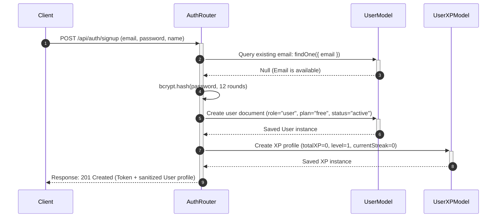
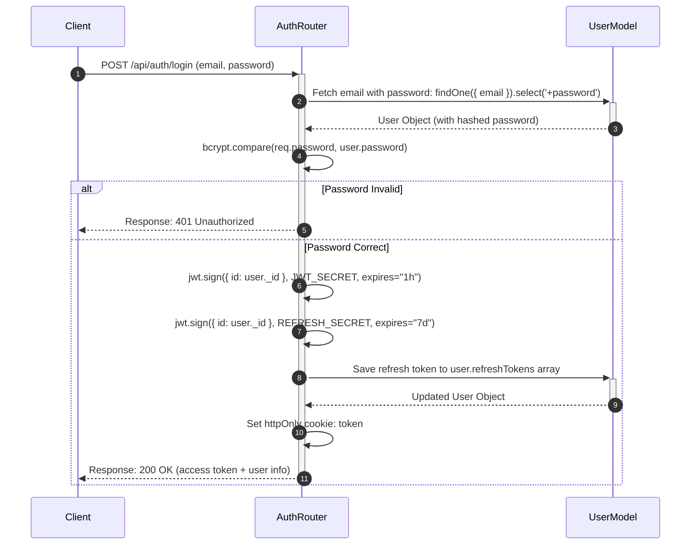
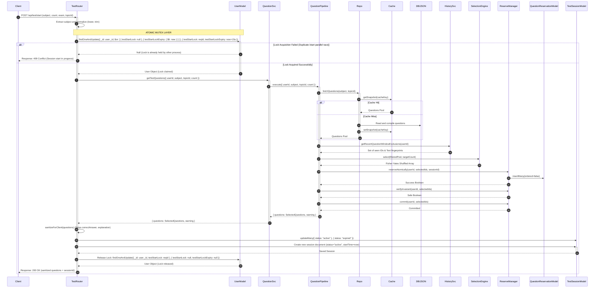
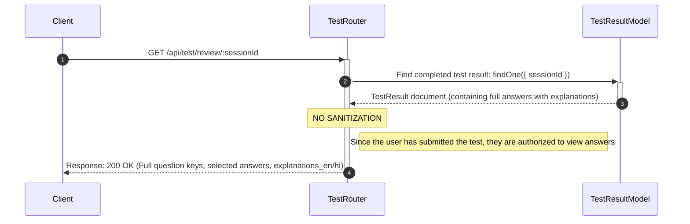
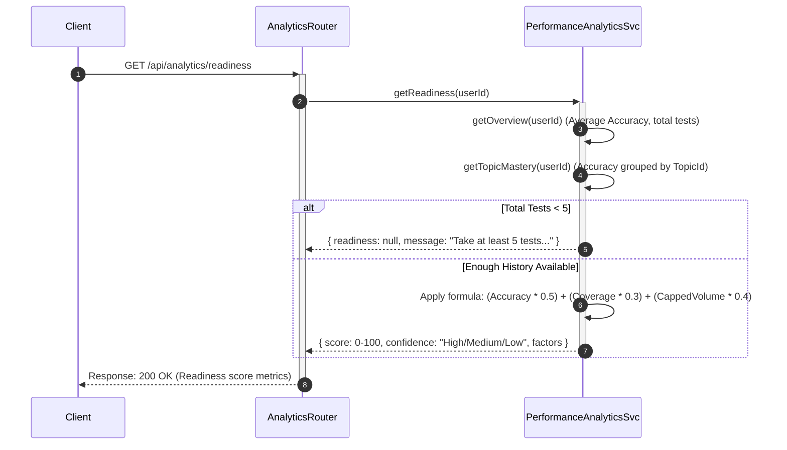
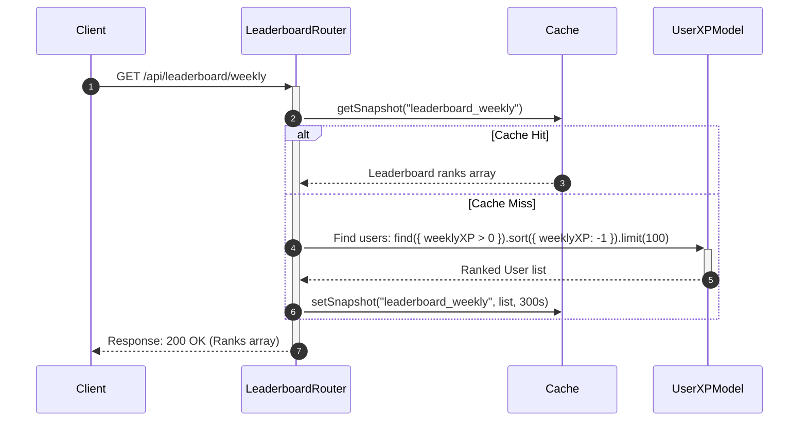
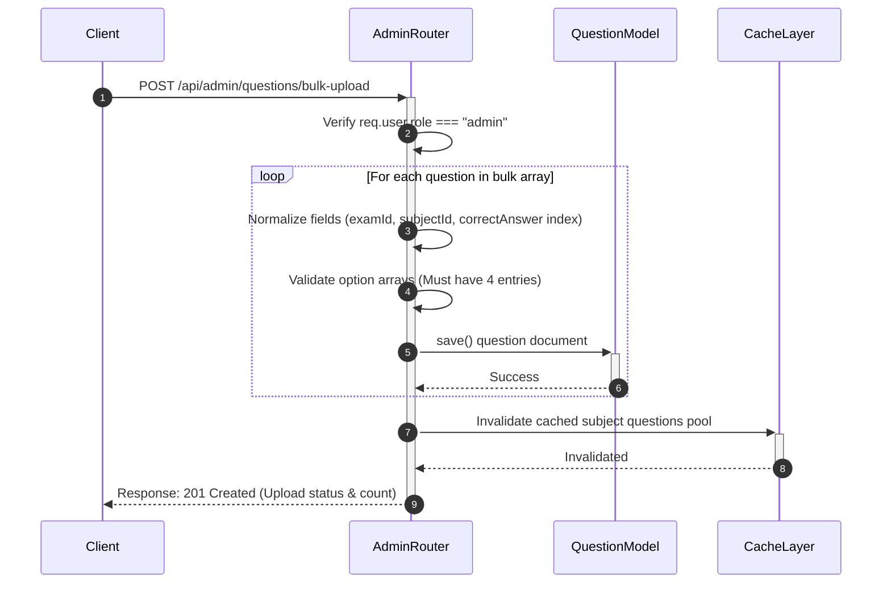

# NirnayPath Core Data Flow Traces

This document details the precise step-by-step data pathways, database queries, and background asynchronous side-effects for the 9 core user journeys of the NirnayPath prep platform.

---

## 1. Signup Flow



---

## 2. Login Flow



---

## 3. Start Test Flow (Crucial Mutex Path)



---

## 4. Submit Test Flow (Scoring & Pipeline Triggering)

```mermaid
sequenceDiagram
    autonumber
    Client ->> +TestRouter: POST /api/test/submit (sessionId, answers)
    
    TestRouter ->> +TestSessionModel: findOneAndUpdate({ sessionId, status: "active" }, { status: "submitted" })
    alt Session Already Submitted or Expired
        TestSessionModel -->> TestRouter: Null / Duplicate Submit
        TestRouter -->> Client: Response: 400 Bad Request / 409 Conflict
    else Session Valid & Claimed
        TestSessionModel -->> -TestRouter: Active Session details
        
        TestRouter ->> TestRouter: Evaluate Score & Correct Answers (Loads full question keys from memory/DB)
        TestRouter ->> +TestResultModel: Create TestResult (score, correct, incorrect, fraudProbabilityScore)
        TestResultModel -->> -TestRouter: Saved TestResult
        
        TestRouter ->> +XPService: awardForTestSubmit(userId, testResult)
        XPService ->> +UserXPModel: Update totalXP, level, weeklyXP, rewardLog
        UserXPModel -->> -XPService: Updated XP profile
        XPService -->> TestRouter: Awards Summary (XP & Level Ups)
        
        TestRouter ->> +AchievementService: evaluateAfterTest(userId, testResult, totalTests, streak)
        AchievementService ->> UserXPModel: Append badge awards
        AchievementService -->> -TestRouter: Array of unlocked badges
        
        TestRouter ->> +QueueSvc: Push to "email-queue" (Job: SendResultEmail)
        QueueSvc ->> RedisQueue: LPUSH email-queue job
        QueueSvc -->> -TestRouter: Dispatched
        
        TestRouter ->> +CacheLayer: Invalidate user recommendation cache
        CacheLayer -->> -TestRouter: Cache cleared
        
        TestRouter -->> -Client: Response: 200 OK (Detailed score, correct answers, explanations, XP gains, badges)
    end
```

---

## 5. Review Test Flow



---

## 6. Dashboard Loading

```mermaid
sequenceDiagram
    autonumber
    Client ->> +UserRouter: GET /api/user/dashboard
    UserRouter ->> Cache: getCachedData("dashboard_stats_" + userId)
    alt Cache Hit
        Cache -->> UserRouter: Dashboard metrics
    else Cache Miss
        UserRouter ->> +TestResultModel: Count tests and gather average scores
        TestResultModel -->> UserRouter: Aggregated stats
        UserRouter ->> +XPService: getSummary(userId)
        XPService ->> +UserXPModel: Fetch level and currentStreak
        UserXPModel -->> -XPService: UserXP record
        XPService -->> -UserRouter: XP and Badge summary
        UserRouter ->> Cache: setCachedData("dashboard_stats_" + userId, data, 600s)
    end
    UserRouter -->> -Client: Response: 200 OK (Streak count, level, recent tests, XP summary)
```

---

## 7. Analytics & Exam Readiness Flow



---

## 8. Leaderboard Loading Flow



---

## 9. Admin Operations Flow


