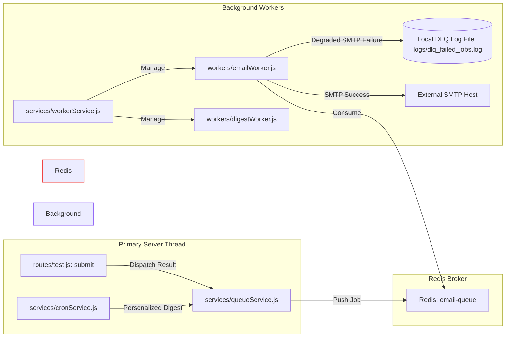

# NirnayPath Dependency Graph & Structural Coupling Analysis

This document provides a detailed visual map of module dependencies and an analysis of coupling violations, duplicate caching layers, and database interactions.

---

## 1. Architectural Layers & Request Flow

The following diagram illustrates how an incoming client request moves through the system from the route handler down to the data persistence layer.

```mermaid
graph TD
    Client[HTTP Client] -->|Express Request| Routes[API Routers: routes/]
    
    subgraph Middleware Stack
        Routes -->|1. Request ID / Context| Tracing[middleware/requestTracing.js]
        Tracing -->|2. Brute Force / Limit checks| RateLimit[middleware/rateLimiter.js]
        RateLimit -->|3. JWT Verification| Auth[middleware/auth.js]
        Auth -->|4. Subscription Check| PlanGuard[middleware/planGuard.js]
    end

    subgraph Service Orchestration
        PlanGuard -->|Mock Session Start| TestRouter[routes/test.js]
        TestRouter -->|Get Questions| QuestionSvc[services/questionService.js]
        QuestionSvc -->|Coordinate Selection| Pipeline[core/questionPipeline.js]
        
        Pipeline -->|1. Query Cache/Disk| Repo[services/questionRepository.js]
        Pipeline -->|2. Fetch Seen History| HistorySvc[services/historyService.js]
        Pipeline -->|3. Filter & Shuffle| SelectEngine[services/selectionEngine.js]
        Pipeline -->|4. Dedup Overlay| DedupEngine[services/dedupEngine.js]
        Pipeline -->|5. Distributed Lock| ReserveManager[services/questionReservationService.js]
    end

    subgraph Data & Persistence
        Repo -->|Memory-Safe Cache| CacheLayer[services/cacheLayer.js]
        Repo -->|Fallback JSON| JSONData[(Local JSON Files: data/)]
        Repo -->|MongoDB Query| QuestionModel[(models/question.js)]
        ReserveManager -->|Mongoose Write| ReserveModel[(models/questionReservation.js)]
        HistorySvc -->|MongoDB Query| TestResultModel[(models/testResult.js)]
    end

    style Client fill:#3b82f6,stroke:#1d4ed8,stroke-width:2px,color:#fff
    style Middleware Stack fill:#f3f4f6,stroke:#d1d5db,stroke-width:1px
    style Service Orchestration fill:#ecfdf5,stroke:#10b981,stroke-width:1px
    style Data & Persistence fill:#fff7ed,stroke:#f97316,stroke-width:1px
```

---

## 2. Background Queue & Event Loop Subsystems

The application handles heavy actions (emails, periodic metrics, analytics) asynchronously via a BullMQ runner backed by Redis.



---

## 3. Coupling & Architectural Drift Violations

The custom runtime checker `services/ArchitectureLockService.js` identifies several key coupling violations where standard interfaces are bypassed, resulting in duplicate processes and unmonitored systems.

### 3.1 Redis Client Bypasses (Rogue Redis Clients)
*   **Canonical Path**: `services/redisService.js` acts as the single connection manager, handling cluster settings, graceful disconnect, and health status indicators.
*   **Violations**:
    1.  `middleware/cache.js`: Creates an independent configuration using `ioredis` instead of relying on `redisService.js` exports.
    2.  `services/NotificationCenterService.js`: Spins up a new unmanaged Redis socket connection with no connection recovery logic.
    3.  `workers/ai-perf-worker.js`: Operates a separate Redis listener inside its worker context, bypassing central connection pool pooling and monitoring.

### 3.2 Cache Layer Duplication (Duplicate In-Memory Stores)
*   **Canonical Path**: `services/cacheLayer.js` implements deep-cloning on write, deep-freezing on read, automated cleaning intervals, and LRU eviction logic.
*   **Violation**:
    *   `middleware/cache.js`: Implements its own duplicate cache map (`localCache`) with ad-hoc version checks and manual expiry sweeps, leading to dual-memory footprints and potential drift.

### 3.3 Event Loop Lag & Replication Metrics Duplication
*   **Canonical Path**: `routes/health.js` uses real engine queries (e.g. Mongoose `admin().ping()`) and direct timers to report node health.
*   **Violation**:
    *   `services/OperationsTelemetryService.js`: Re-implements its own event-loop lag monitor and publishes fake, randomized metrics (e.g. `Math.random() * 100` for replica lag) rather than reading from active resources.
