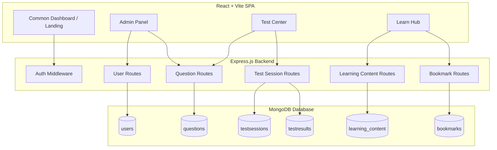

# NirnayPath 3.0 Project Architecture

This document describes the high-level system architecture of NirnayPath 3.0, built from scratch to support the **LEARN** and **MOCK TEST** platform modules.

---

## 1. Architectural Principles

To ensure professional-grade quality, performance, and long-term stability:
- **Product Independence**: The LEARN and MOCK TEST engines are decoupled. The UI features separate paths, and states are isolated so a user choosing only one product experiences a clean, focused workflow.
- **Stateless Backend**: The Express.js backend utilizes stateless JSON Web Token (JWT) authentication, allowing simple scalability.
- **Single DB Layer (MongoDB)**: All persistence runs on MongoDB with Mongoose ODM. Direct indexing prevents slow collection-wide scans, satisfying performance requirements.
- **Client-Side Rendering (CSR)**: Powered by React + Vite + TailwindCSS for fast, fluent, interactive client interfaces.

---

## 2. System Diagram

---

## 3. Component Details

### Frontend (React Single Page Application)
- **State Management**: React Context / Hooks for simple state tracking (e.g. active test session, user auth, current learning node).
- **Styling**: TailwindCSS for premium gradients, glassmorphism, responsive grids, and clean layout patterns.
- **Routing**: React Router DOM for clean segment paths:
  - `/` - Landing & Auth selection
  - `/dashboard` - Unified statistics (combines Learn + Test data if both are active)
  - `/learn/*` - Subject/Topic/Subtopic navigation, rich text, PYQs and Practice MCQs
  - `/test/*` - Subject, Topic, and Full Mock Exams with real-time timers
  - `/admin/*` - Content management dashboards

### Backend (Node.js + Express)
- **API Server**: Exposes REST endpoints for all data CRUD operations.
- **Authentication**: JWT authentication with Access (short-lived) and Refresh (long-lived) tokens stored in HTTP-only cookies.
- **Performance Constraints**: Strict DB queries using indexes on fields: `exam`, `subject`, `topic`, `subtopic`, and `userId`.

### Data Engine (MongoDB)
- Strictly 6 collections: `users`, `questions`, `testsessions`, `testresults`, `learning_content`, `bookmarks`.
- Prepopulated initially via static question JSON files and syllabus templates.
