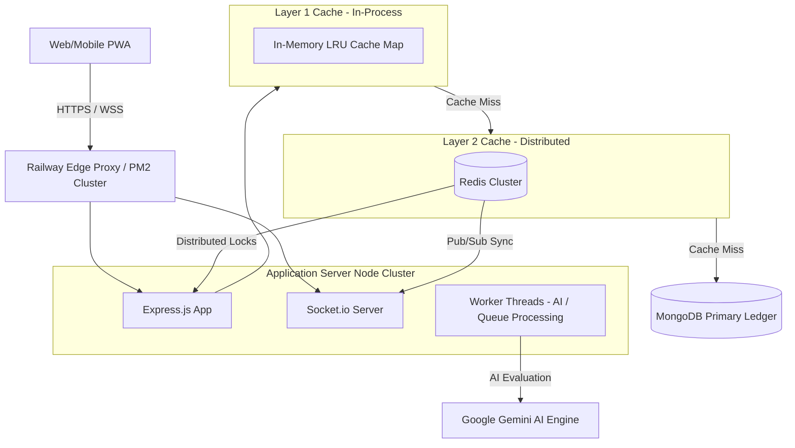

# 🔱 NirnayPath Production Platform

[](https://github.com/Saurabh12770/nirnaypath-live)
[](https://nodejs.org/)
[](https://www.mongodb.com/)
[](https://redis.io/)

NirnayPath is a highly scalable, production-grade EdTech SaaS platform engineered for high-concurrency, national-scale examinations. Architected as an autonomous, self-healing digital public infrastructure, the platform handles massive parallel student request volumes, real-time live exam orchestration, AI-driven adaptive learning pipelines, and comprehensive SRE observability.

---

## 🏛️ System Architecture

NirnayPath utilizes a multi-tiered architecture designed for ultra-low latency, extreme reliability, and horizontal scalability.



### 🧠 Architectural Highlights
*   **L1/L2 Hybrid Caching**: Reads hit the ultra-fast in-process L1 Cache first (< 1ms). Cache misses query the L2 Distributed Redis Cache (~1-5ms) before falling back to MongoDB.
*   **Stale-While-Revalidate (SWR)**: High-read APIs serve slightly stale data instantly to prevent thundering herds, concurrently triggering asynchronous background cache revalidation.
*   **Distributed Locking**: Safe, memory-backed or Redis-backed concurrency locks prevent double-test-submissions or database race conditions.
*   **Zero-Trust Security**: Hardened JWT verification, rate-limiting layers, raw-body webhook verification, and path traversal guards.
*   **Telemetry & Self-Healing**: Automated monitoring tracks event-loop lag, query performance, and memory pressure, applying automatic mitigations (e.g. L1 fallback, degraded database operations) when load spikes.

---

## 📂 Project Directory Structure

```text
├── config/                  # System-wide configuration schemas, security constraints, and whitelists
├── core/                    # Core computational libraries, AI engines, and adaptive test algorithms
├── docs/                    # Architectural documents, architectural plans, and system guides
├── middleware/              # Express middlewares (Auth, Plan Guard, Rate Limiting, Idempotency, Caching)
├── models/                  # Hardened Mongoose/MongoDB data model declarations
├── public/                  # PWA Frontend Assets (HTML, CSS, JS, UI components, custom metrics dashboards)
├── routes/                  # REST API routes (Admin, Auth, Chat, Engagement, Health, Live, Tests, Telemetry)
├── schemas/                 # Validation and serialization schemas for incoming request bodies
├── scripts/                 # Automation scripts, PM2 startups, database seeders, and Linux import audits
├── services/                # Core singleton services (Email, Cache Layer, Distributed Locks, Cron, Telemetry)
├── tests/                   # Security regression suites, Chaos suites, and Scale performance test suites
├── utils/                   # Shared utility modules, custom logs formatting, and file loaders
└── workers/                 # Computational worker threads (AI generation, mailers, background processing)
```

---

## 💾 Core Database Models & Schemas

### Mongoose (MongoDB) Models
1.  **User (`models/user.js`)**
    *   System identity ledger. Stores profile details, password hashes, multi-factor tokens, subscription tiers (`FREE`, `PRO`, `ENTERPRISE`), and administrative role controls.
2.  **BlogPost (`models/BlogPost.js`)**
    *   Content model representing community articles, announcement blogs, or system updates. Fully indexed for fast title/tag search.
3.  **Coupon (`models/Coupon.js`)**
    *   SaaS promotional codes with atomic use counters, expiration validations, minimum cart values, and user restriction arrays.
4.  **LiveSession (`models/liveSession.js`)**
    *   Holds metadata for high-concurrency national-scale scheduled mock examinations. Handles exact start/end windows, topic assignments, and question pools.
5.  **LiveResult (`models/liveResult.js`)**
    *   Stores answers and scores for Live sessions. Hardened with a unique compound index on `{ userId: 1, liveSessionId: 1 }` to guarantee single-submission integrity.
6.  **TestResult (`models/testResult.js`)**
    *   Standard test results record containing exact time spent, score metrics, accuracy percentages, subject performance matrices, and final analytics reports.
7.  **TestSession (`models/testSession.js`)**
    *   Stateful tracker for ongoing active exams. Stores current progress, chosen answers, remaining time, and is equipped with a 24-hour MongoDB TTL index for automatic cleanup of stale sessions.

### Redis Keyspace Design
*   `np:cache:<version>:<key>`: Standard key-value cache with structural SWR headers.
*   `lock:<resource>`: Distributed locking key pattern (TTL-guarded) utilized by `distributedLockService`.
*   `rate:<ip_or_user_id>:<endpoint>`: Concurrency rate limit buckets (Redis atomic `INCR` + `EXPIRE`).
*   `idem:<key>`: Idempotency keys storing exact stringified historical HTTP responses to prevent transaction double-executes.

---

## ⚡ Setup & Local Development

Follow these steps to run a production-equivalent NirnayPath instance locally on Windows or Linux:

### 1. Prerequisites
Ensure you have the following installed:
*   **Node.js** (v18.x or above)
*   **MongoDB** (v6.0 or above)
*   **Redis** (v7.x or above)

### 2. Clone and Install Dependencies
```bash
git clone https://github.com/Saurabh12770/nirnaypath-live.git
cd NirnayPath
npm install
```

### 3. Start Database Services
*   **MongoDB**: Start your local MongoDB server (port `27017`).
*   **Redis**: Start your local Redis instance (port `6379`).

### 4. Configure Environment Variables
Create a `.env` file in the root directory:
```env
PORT=3000
NODE_ENV=production
JWT_SECRET=supersecretkeythatisverysecureandawesome
REFRESH_TOKEN_SECRET=supersecretrefreshkeythatisverysecure
MONGO_URI=mongodb://localhost:27017/nirnaypath
REDIS_URL=redis://localhost:6379

# Email Service
EMAIL_HOST=smtp.ethereal.email
EMAIL_PORT=587
EMAIL_SECURE=false
EMAIL_USER=your_ethereal_user
EMAIL_PASS=your_ethereal_password
EMAIL_FROM="NirnayPath" <your_ethereal_user>
```

### 5. Execute Run & Test Commands
*   **Start Application Server**:
    ```bash
    npm run dev
    ```
*   **Run Chaos Regression Suite (100% Pass Required)**:
    ```bash
    npm test
    ```
*   **Run Scale & Performance Profiler**:
    ```bash
    node tests/verify_scale_runtime.js
    ```

---

## 🛡️ Production Deployment & Self-Healing

NirnayPath is architected for zero-downtime platforms like **Railway**, **PM2 Clusters**, or **Docker Compose**.

### PM2 Clustering & Lifecycle Configuration
Manage the server under load using PM2. Use the predefined `ecosystem.config.js` to enable cluster mode, automatically distributing traffic across multiple CPU cores:
```bash
pm2 start ecosystem.config.js
```

### Linux Case-Sensitivity Safeguard
In Windows, file paths are case-insensitive. In Linux, they are strict. NirnayPath prevents case mismatch import crashes in production through an automated pre-start script:
```bash
npm run prestart
```
This runs `scripts/linuxImportAudit.js` to scan the codebase for dynamic imports, matching require paths with filesystem paths before boot, stopping deployment if a mismatch occurs.

---

## 📊 Observability & SRE Endpoints

NirnayPath contains SRE-grade telemetry routes to monitor system performance at scale:

*   `/health` (Public): Returns a high-level system status (`green` / `yellow` / `red`) alongside DB and Redis connection states.
*   `/api/health/deep` (Authenticated SRE): Returns detailed statistics, L1 vs. L2 cache hit ratios, Redis memory utilization, active queue items, database query profiling, and background worker workloads.
*   `/api/health/env-audit` (Admin Only): Returns system environment configurations, checking for missing production keys and deployment drift, protected behind strict authorization.

---

## 🛠️ Troubleshooting & Diagnostics

#### 1. Redis Connection Failures (`WARN: Redis unavailable, returning fallback metrics`)
*   **Behavior**: The platform will not crash. It automatically disables background queues, switches the caching layer to **L1 Memory Mode**, and swaps Redis locks with a memory-safe local Map queue.
*   **Solution**: Check if Redis is running locally. Ensure `REDIS_URL` in `.env` is correct.

#### 2. Duplicate Listener Warnings (`Warning: Possible EventEmitter memory leak detected`)
*   **Behavior**: PM2 soft restarts may cause multiple event handler registrations.
*   **Solution**: NirnayPath uses an idempotent lock on startup process listeners (`CrashReportingService`), ignoring subsequent registers. No action needed.

#### 3. Database Connection Timeouts
*   **Behavior**: MongoDB connection is dropped or throttled under scale.
*   **Solution**: NirnayPath uses a customized MongoDB boot configuration with a 5000ms server selection timeout and handles disconnected state gracefully by returning cached static pools.

---

## 🔱 SRE Production Release Notes & Hotfixes (May 2026)

The NirnayPath SRE and Core Architecture team has successfully deployed a critical platform-wide production hardening and stabilization pass. Below are the audited fixes and their architectural impacts:

### 1. 🧠 Hardened AI Service & API Key Resilience
- **Audited Files**: [aiService.js](file:///c:/Users/SAURABH%20KUMAR/Desktop/NirnayPath/services/aiService.js), [chat.js](file:///c:/Users/SAURABH%20KUMAR/Desktop/NirnayPath/routes/chat.js)
- **Key Enhancements**:
  - Full, safe support for both `GEMINI_API_KEY` and `AI_API_KEY` environment variables.
  - Non-blocking startup warnings validating missing or dummy API keys without crashing Node.js process boot.
  - Structured, zero-faking fallback mechanism returned directly from route handlers when AI services fail: `{ success: false, source: "fallback", message: "AI service unavailable" }`. Bypasses DB writes and quota increments on failures.

### 2. 📳 Push Notification VAPID Resilience
- **Audited Files**: [pushService.js](file:///c:/Users/SAURABH%20KUMAR/Desktop/NirnayPath/services/pushService.js), [notificationService.js](file:///c:/Users/SAURABH%20KUMAR/Desktop/NirnayPath/services/notificationService.js)
- **Key Enhancements**:
  - Catching `403` VAPID credential mismatches alongside standard `404` and `410` status codes.
  - Automatically nullifying the invalid user's `pushSubscription` field in MongoDB to prevent cron loops and message delivery cascades.

### 3. 🖼️ Real Custom PWA Assets & Icon Audits
- **Audited Files**: [manifest.json](file:///c:/Users/SAURABH%20KUMAR/Desktop/NirnayPath/public/manifest.json), `public/icons/*`, `public/assets/logo-192.png`, `public/images/logo-icon.png`
- **Key Enhancements**:
  - Generated and deployed custom, high-quality, professional compass-themed PNG icons for 192x192 and 512x512 sizes.
  - Resolved stylesheet logo-icon 404s and satisfied PWA and push notification icon requirements natively.
  - Eliminated dead and broken layout asset references.

### 4. 📝 Strict Test Submission Normalization
- **Audited Files**: [test.js](file:///c:/Users/SAURABH%20KUMAR/Desktop/NirnayPath/routes/test.js)
- **Key Enhancements**:
  - Strict payload validation supporting both flat array structures and key-value JSON object patterns (`{"q1":"A", "q2":"B"}`).
  - Immediate server-side normalization into one standard internal layout format: `[{ questionId, answer }]` before hitting the evaluation and scoring logic.
  - Diagnostic error logging for SRE audit trails during payload anomalies.

### 5. 🛑 Duplicate Logout Request Debouncer
- **Audited Files**: [auth.js](file:///c:/Users/SAURABH%20KUMAR/Desktop/NirnayPath/public/js/auth.js)
- **Key Enhancements**:
  - Added strict `eventListenersSetup` boolean locks to prevent duplicate listener bindings if initialised multiple times.
  - Implemented `logoutInProgress` active locks to debounce user click actions and completely eliminate duplicate parallel logout network requests.

### 6. ⚡ memory-safe LRU+TTL Question Lazy Loading
- **Audited Files**: [questionRepository.js](file:///c:/Users/SAURABH%20KUMAR/Desktop/NirnayPath/services/questionRepository.js), [questionLoader.js](file:///c:/Users/SAURABH%20KUMAR/Desktop/NirnayPath/utils/questionLoader.js)
- **Key Enhancements**:
  - Disabled full boot-time precompilation of whitelisted subjects to completely eliminate startup memory spikes and Railway OOM crash risks.
  - Implemented a custom, zero-dependency `LruTtlCache` (5 subjects max size, 5 minutes TTL eviction).
  - Precompiles only three high-priority subjects (`history`, `polity`, `geography`) asynchronously in the background.
  - Automatically lazy-loads, deep-freezes, and caches all other subjects dynamically upon request, achieving sub-millisecond warm read latency.

---
*Created and maintained by the NirnayPath SRE & Core Architecture team.*
