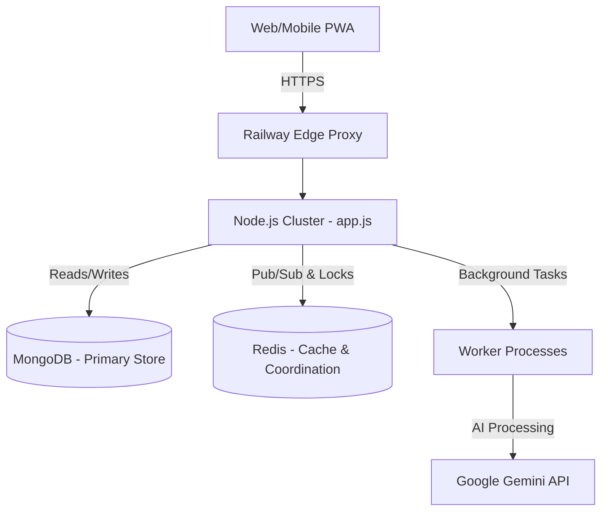

# NirnayPath Production Platform

## Project Overview
NirnayPath is a highly scalable, production-grade EdTech SaaS platform designed for high-concurrency national-scale examinations. It operates as an autonomous, self-healing digital public infrastructure, complete with robust backend systems (Node.js), real-time capabilities (Socket.io), worker threads for AI integration, and zero-trust security measures.

## Folder Structure
```text
/config         - Configuration schemas and system defaults
/core           - Core processing algorithms (e.g. Adaptive Engines, AI)
/docs           - System documentation and architectural master plans
/middleware     - Express route middlewares (Auth, rate limit, logging)
/models         - Mongoose database schemas
/public         - Static frontend assets (HTML, CSS, JS, images, fonts)
/routes         - Express API routing modules
/scripts        - Automation scripts (Audit, build, maintainability)
/services       - Core singleton services (Redis, Notifications, Analytics)
/tests          - Chaos regression suites and security testing
/utils          - Utility helpers and loggers
/workers        - Background processing threads (AI, Notifications)
```

## Setup & Execution
1. Ensure Node.js (v18+) and MongoDB are installed. (Redis is optional but recommended).
2. Install dependencies: `npm install`
3. Setup Environment Variables (see below).
4. Run server: `npm run start`
5. Run tests: `npm test`

## Environment Variables
Create a `.env` file based on `.env.example`:
- `PORT`: Server port (default 3000)
- `MONGO_URI`: MongoDB connection string
- `REDIS_URL`: Redis connection URL (enables pub/sub and distributed locking)
- `JWT_SECRET`: Secret key for authentication
- `NODE_ENV`: 'development' or 'production'

## Deployment Steps
NirnayPath is optimized for **Railway** deployment.
1. Push `master` to your linked GitHub repository.
2. Railway will automatically pick up `package.json`.
3. It will run `npm run prestart` (`linuxImportAudit.js`) to guarantee case-sensitivity correctness on Linux.
4. Server starts with `node app.js`.
5. Ensure `MONGO_URI` and `REDIS_URL` are bound as Railway variables.

## Latest Active Systems
- **Architecture Lock Service**: Prevents code drift and runtime duplication.
- **Chaos Regression Suite**: Guarantees recovery from Mongo/Redis disconnects.
- **Cache Coordinator**: Prevents stale cache anomalies using strict versioning.
- **Worker Auto-Scaling**: Dynamic worker processes triggered on load.

## API List (High-Level)
- `GET /health`: SRE-level health check, Redis/Mongo ping latency.
- `POST /api/auth/*`: Authentication and JWT issuance.
- `GET/POST /api/exams/*`: Examination lifecycle endpoints.
- `POST /api/telemetry/*`: Submits frontend behavioral data.

## Architecture Diagram (Mermaid)


## Redis Usage
Redis (`ioredis`) is structurally integrated as an optional but critical layer:
- **Distributed Locking**: Prevents race conditions during exam submission.
- **Pub/Sub System**: Powers the Socket.IO cluster synchronization.
- **In-Memory Cache**: LRU-eviction caching for high-read APIs.

## Mongo Usage
Mongoose operates as the primary ledger. It ensures document-level consistency and is hardened against missing connection strings gracefully handling reconnects under extreme load.

## Worker Architecture
Heavy computational tasks (e.g., adaptive test AI generation, email dispatching, analytics normalization) are processed off the main thread.
- `workers/ai-perf-worker.js`: Handles backend intelligence processing.
- Workers scale automatically or back off when Redis is unready.

## Troubleshooting
- **Missing Module Error (Linux)**: Ensure the import string perfectly matches the file case. Run `npm run prestart` locally.
- **Redis Connection Error**: Ensure `REDIS_URL` is active. If disconnected, the system gracefully degrades to memory locks and disables background workers.
- **PM2/Cluster Restarts**: The Crash Reporting Service intercepts fatal signals and ensures graceful disconnection to prevent zombie processes.
