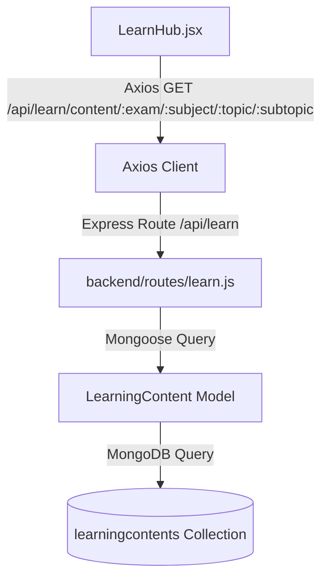
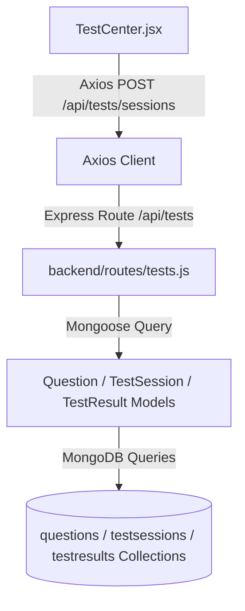

# NirnayPath 3.0 — Content Source Map

This document traces the complete data flow for learning content and assessment questions from the frontend user interface down to the backend API routes, controller logic, and MongoDB database collections.

---

## 📚 1. LearnHub Data Flow

Traces how study notes and syllabus modules are loaded and rendered.

### Flow Diagram

### Flow Details
- **Frontend Page**: [LearnHub.jsx](file:///c:/Users/SAURABH%20KUMAR/Desktop/NirnayPath/frontend/src/pages/LearnHub.jsx)
- **API Client**: [api.js](file:///c:/Users/SAURABH%20KUMAR/Desktop/NirnayPath/frontend/src/services/api.js) makes request:
  `GET /learn/content/:exam/:subject/:topic/:subtopic`
- **Backend Entry Point**: [app.js](file:///c:/Users/SAURABH%20KUMAR/Desktop/NirnayPath/backend/app.js) mounts route file:
  `app.use('/api/learn', learnRoutes);`
- **Backend Router**: [learn.js](file:///c:/Users/SAURABH%20KUMAR/Desktop/NirnayPath/backend/routes/learn.js) handles:
  `GET /content/:exam/:subject/:topic/:subtopic`
- **Controller Query Logic**: Inline async controller within `router.get(...)` (lines 16-61).
- **Mongoose Model**: [LearningContent.js](file:///c:/Users/SAURABH%20KUMAR/Desktop/NirnayPath/backend/models/LearningContent.js)
- **Database Target**: 
  - **MongoDB Collection**: `learningcontents`
  - **Record Count**: **790** documents

---

## ⚡ 2. TestCenter Data Flow

Traces how assessment questions are fetched, autosaved, and submitted for grading.

### Flow Diagram

### Flow Details
- **Frontend Page**: [TestCenter.jsx](file:///c:/Users/SAURABH%20KUMAR/Desktop/NirnayPath/frontend/src/pages/TestCenter.jsx)
- **API Client Requests**:
  1. **Start Session**: `POST /tests/sessions`
  2. **Autosave Progress**: `PUT /tests/sessions/:id`
  3. **Submit Session**: `POST /tests/sessions/:id/submit`
  4. **View Graded Result**: `GET /tests/results/:id`
- **Backend Entry Point**: [app.js](file:///c:/Users/SAURABH%20KUMAR/Desktop/NirnayPath/backend/app.js) mounts route file:
  `app.use('/api/tests', testRoutes);`
- **Backend Router**: [tests.js](file:///c:/Users/SAURABH%20KUMAR/Desktop/NirnayPath/backend/routes/tests.js)
- **Mongoose Models**:
  - [Question.js](file:///c:/Users/SAURABH%20KUMAR/Desktop/NirnayPath/backend/models/Question.js) (For fetching questions)
  - [TestSession.js](file:///c:/Users/SAURABH%20KUMAR/Desktop/NirnayPath/backend/models/TestSession.js) (For tracking active session progress)
  - [TestResult.js](file:///c:/Users/SAURABH%20KUMAR/Desktop/NirnayPath/backend/models/TestResult.js) (For storing graded historical scores)
- **Database Targets**:
  - **MongoDB Collection `questions`**: Stores all available mock test items.
    - **Record Count**: **134,861** documents
  - **MongoDB Collection `testsessions`**: Stores active answers and countdown timer states.
    - **Record Count**: Dynamic (temporary state)
  - **MongoDB Collection `testresults`**: Stores final score, accuracy, and strong/weak topic lists.
    - **Record Count**: Dynamic (grows with attempts)
